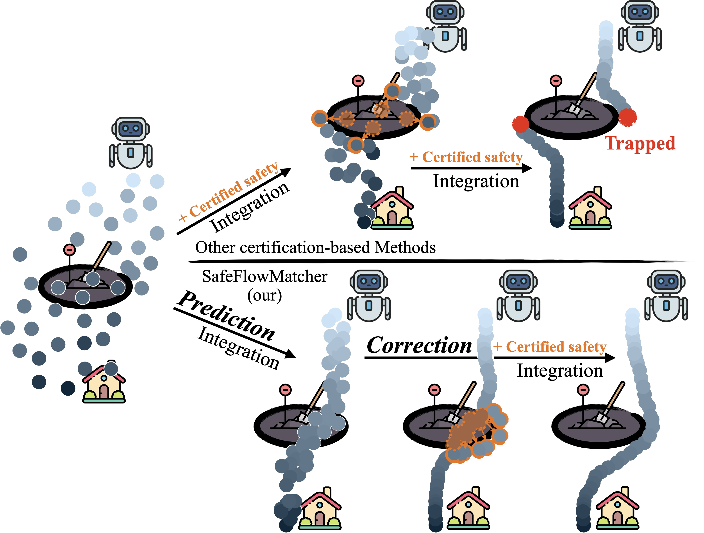

# SafeFlowMatcher

### Safe and Fast Planning using Flow Matching with Control Barrier Functions

**ICLR 2026**

[Jeongyong Yang](https://github.com/takahashi-seiryu)\*, [Seunghwan Jang](https://github.com/Jang-seunghwan)\*†, SooJean Han

Korea Advanced Institute of Science and Technology (KAIST)

\*Equal contribution. †Corresponding author.

[[Paper]](https://openreview.net/forum?id=refcXHU1Nh) [[Project Page]](https://takahashi-seiryu.github.io/SafeFlowMatcher/) [[ICLR Virtual]](https://iclr.cc/virtual/2026/poster/10007129)

<!-- [PLACEHOLDER] Add overview figure: assets/overview.png
     Recommended: A single-panel figure showing the prediction-correction pipeline.
     Left: noise -> FM integration -> candidate path (Prediction Phase)
     Right: candidate path -> VTFD + CBF-QP -> safe path (Correction Phase)
     Can reuse the problem_definition.png from the paper or create a cleaner version.
-->
<p align="center">
  
</p>

<p align="center">
  <b>SafeFlowMatcher</b> decouples generation and certification: flow matching first generates paths without intervention,
  then CBF-based corrections enforce certified safety via a prediction–correction integrator.
</p>

---

## Highlights

- **Certified Safety**: Couples flow matching with control barrier functions (CBFs) to provide formal safety guarantees via a barrier certificate (forward invariance + finite-time convergence to the safe set).
- **Real-Time Efficiency**: A single-step prediction + short correction horizon achieves state-of-the-art planning quality in ~4.7ms per path.
- **Zero Local Traps**: By enforcing safety only on the executed path (not intermediate latents), SafeFlowMatcher avoids distributional drift and eliminates local trap failures.
- **Versatile**: Validated on maze navigation (Maze2D-large), locomotion (Walker2D, Hopper), and robot manipulation (Kuka).

## Main Results

### Maze2D Navigation

| Method | BS1 (≥0) | BS2 (≥0) | Score ↑ | Time (ms) | Trap Rate ↓ |
|--------|----------|----------|---------|-----------|-------------|
| Diffuser | -0.825 | -0.784 | 1.572±0.288 | **3.70** | 0% |
| RES-SafeDiffuser | 0.010 | 0.010 | 1.442±0.451 | 4.72 | 72% |
| TVS-SafeDiffuser | -0.003 | -0.003 | 1.506±0.405 | 4.78 | 69% |
| RES-SafeFM | 0.010 | 0.010 | 1.401±0.429 | 4.74 | 12% |
| **SafeFlowMatcher (Ours)** | **0.010** | **0.010** | **1.632±0.003** | 4.71 | **0%** |

### High-Dimensional Robotic Tasks

| Environment | Method | Score ↑ | BS (≥0) |
|-------------|--------|---------|---------|
| Walker2D | SafeDiffuser | 0.321±0.119 | Yes |
| Walker2D | SafeFM | 0.264±0.127 | Yes |
| Walker2D | **SafeFlowMatcher (Ours)** | **0.331±0.021** | **Yes** |
| Hopper | SafeDiffuser | 0.464±0.028 | Yes |
| Hopper | SafeFM | 0.675±0.312 | Yes |
| Hopper | **SafeFlowMatcher (Ours)** | **0.917±0.026** | **Yes** |

---

## Installation

```bash
conda env create -f environment.yml
conda activate safe_cfm
pip install -e .
pip install qpth cvxpy cvxopt
pip install torchdyn torchdiffeq torchcfm
pip install git+https://github.com/atong01/conditional-flow-matching.git
```

## Training

### Maze2D

**Conditional Flow Matching:**
```bash
python scripts/train.py --config config.maze2d --dataset maze2d-large-v1 --method cfm
```

**Diffuser (baseline):**
```bash
python scripts/train.py --config config.maze2d --dataset maze2d-large-v1 --method base
```

### Locomotion
```bash
python scripts/train.py --dataset walker2d-medium-expert-v2
```

The default hyperparameters are listed in `config/maze2d.py` and `config/locomotion.py`. You can override any of them with flags, e.g., `--n_diffusion_steps 100`.

### Value Function
```bash
python scripts/train_values.py --dataset walker2d-medium-expert-v2
```

## Planning (Evaluation)

### Maze2D

**Conditional Flow Matching:**
```bash
python scripts/plan_maze2d.py --config config.maze2d --dataset maze2d-large-v1 --logbase logs --method cfm
```

**Diffuser (baseline):**
```bash
python scripts/plan_maze2d.py --config config.maze2d --dataset maze2d-large-v1 --logbase logs --method base
```

### Locomotion
```bash
python scripts/plan_guided.py --dataset walker2d-medium-expert-v2 --logbase logs
```

## Project Structure

```
SafeFlowMatcher/
├── config/                 # Hyperparameter configurations
│   ├── maze2d.py          # Maze2D environment config
│   └── locomotion.py      # Locomotion environment config
├── diffuser/              # Core model implementation
│   ├── datasets/          # Dataset loaders (D4RL)
│   ├── environments/      # Environment wrappers
│   ├── guides/            # Guidance modules (covariance-aware guidance)
│   ├── models/            # Flow matching & diffusion model architectures
│   └── utils/             # Utility functions (training, evaluation, safety)
├── scripts/               # Training & evaluation scripts
│   ├── train.py           # Train flow matching / diffusion models
│   ├── plan_maze2d.py     # Evaluate on Maze2D
│   └── plan_guided.py     # Evaluate on locomotion tasks
├── docs/                  # Project page (GitHub Pages)
├── environment.yml        # Conda environment specification
└── setup.py               # Package installation
```

## Citation

If you find this work useful, please cite our paper:

```bibtex
@inproceedings{yang2026safeflowmatcher,
  title={SafeFlowMatcher: Safe and Fast Planning using Flow Matching with Control Barrier Functions},
  author={Yang, Jeongyong and Jang, Seunghwan and Han, SooJean},
  booktitle={International Conference on Learning Representations (ICLR)},
  year={2026}
}
```

## Acknowledgements

- The diffusion model implementation is based on [Diffuser](https://github.com/jannerm/diffuser) by Michael Janner.
- The safe diffusion implementation is based on [SafeDiffuser](https://github.com/Weixy21/SafeDiffuser) by Wei Xiao.

## License

This project is licensed under the MIT License - see the [LICENSE](LICENSE) file for details.
